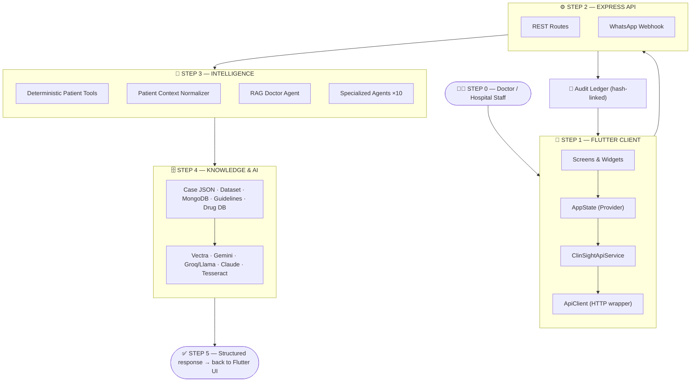
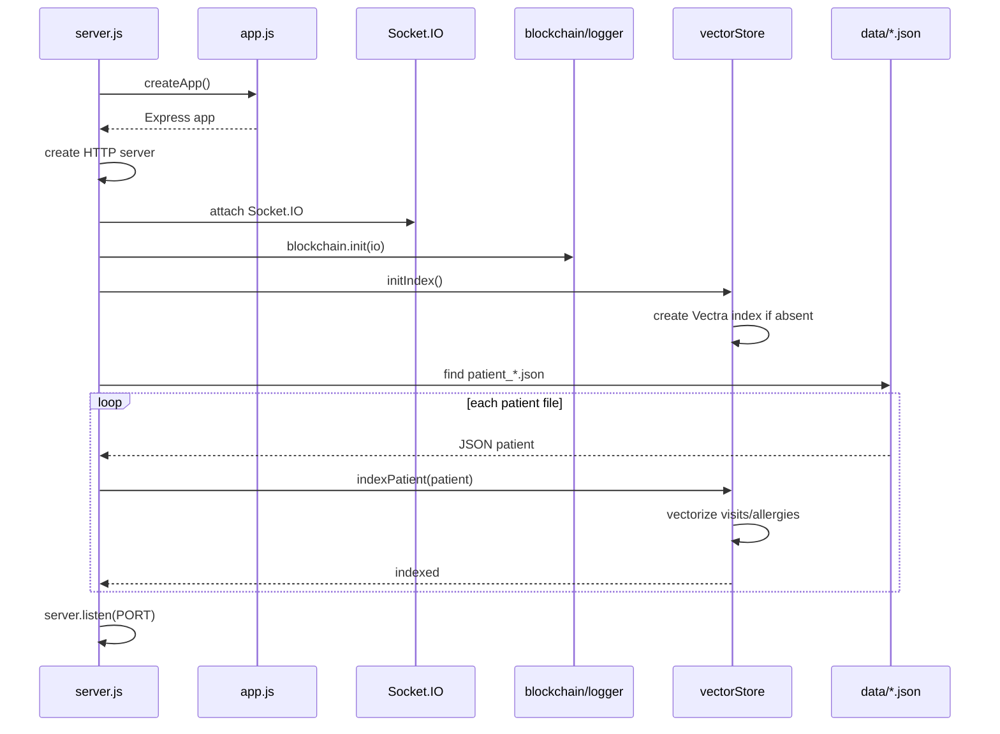
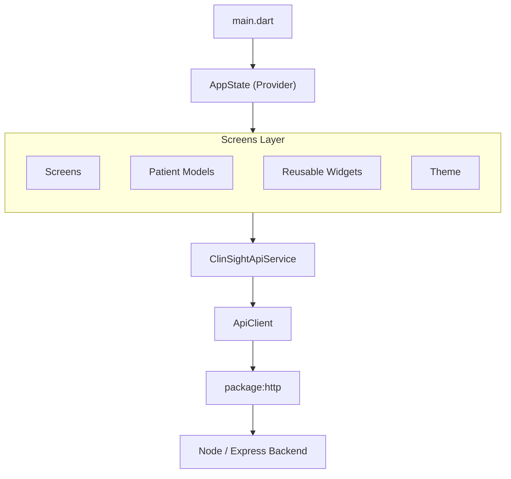
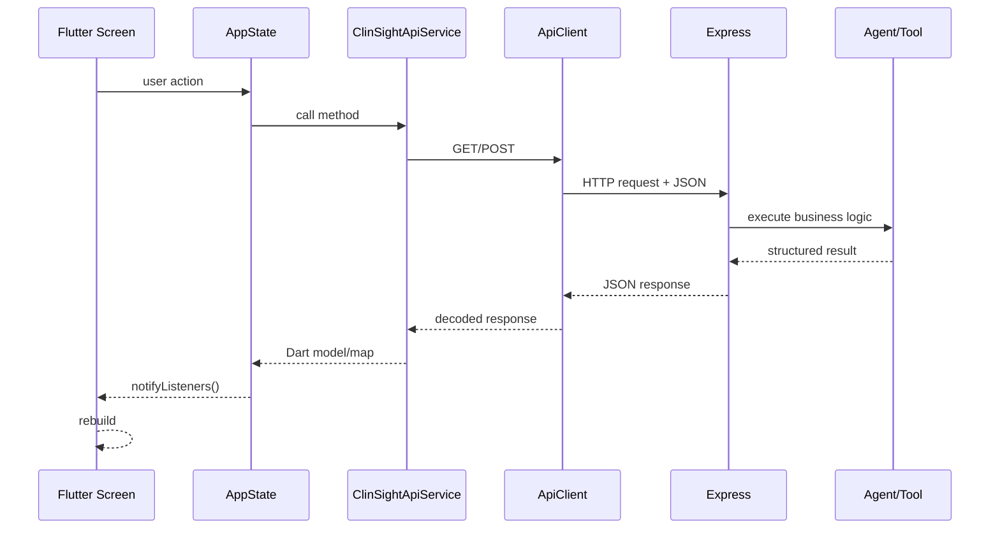
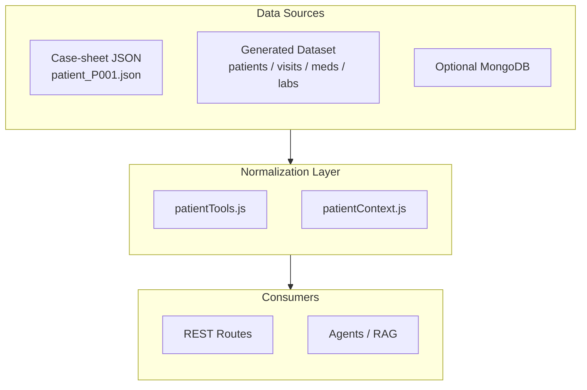
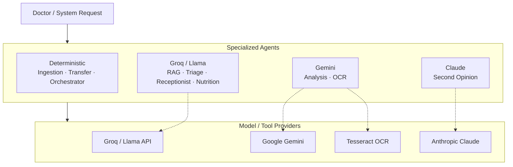
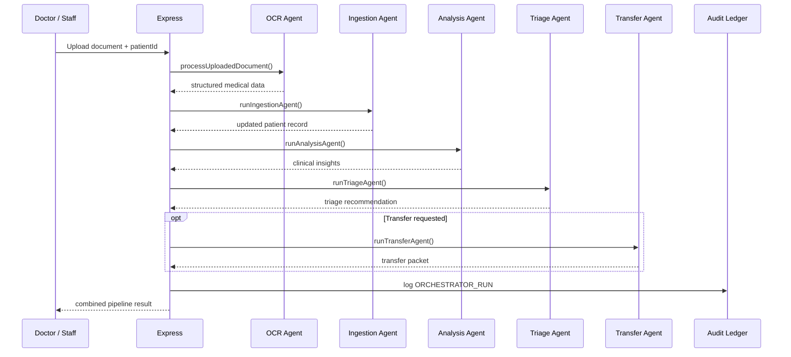
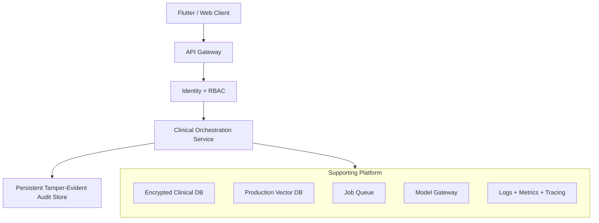

<div align="center">

# 🏥 ClinSight AI

### Clinical Intelligence & Multi-Agent Patient Assistant

*A digital hospital team — not just another chatbot.*

[](#)
[](#)
[](#)
[](#)
[](#)
[](#)
[](#project-status)

</div>

---

## 📖 Table of Contents

- [What is ClinSight?](#-what-is-clinsight)
- [High-Level Architecture](#️-high-level-architecture)
- [Repository Structure](#-repository-structure)
- [Backend Startup Flow](#-backend-startup-flow)
- [Flutter Client Architecture](#-flutter-client-architecture)
- [Data Architecture](#-data-architecture)
- [RAG Pipeline](#-retrieval-augmented-generation-rag)
- [Specialized Agents](#-specialized-agents)
- [Audit Ledger ("Blockchain")](#-audit-ledger-blockchain-style-hash-chain)
- [REST API Reference](#-rest-api-reference)
- [Environment Variables](#-environment-variables)
- [Getting Started](#-getting-started)
- [Testing](#-testing)
- [Current Limitations](#️-current-limitations)
- [Production Roadmap](#-production-roadmap)

---

## 🩺 What is ClinSight?

**ClinSight AI** is a clinical-intelligence platform that sits between hospital staff and fragmented patient records. It combines:

- 📱 A **Flutter** client
- ⚙️ A **Node.js / Express** backend
- 🧮 Deterministic clinical tools
- 🔎 Retrieval over patient records (RAG)
- 🧠 Multiple LLM providers
- 📄 OCR-based document ingestion
- 🔁 Specialist-transfer workflows
- 💬 WhatsApp integration
- 🔗 A hash-linked audit ledger

Think of it as a **digital hospital team**: a doctor talks to the Flutter app, the app talks to the backend, and the backend pulls patient data, runs deterministic tools and/or specialized AI agents, retrieves relevant context from a local vector index, asks an LLM to interpret it, and returns a structured, clinically-framed answer.

> **Mental model:** Flutter asks → Express routes → tools retrieve → RAG retrieves relevant context → specialized agents process → LLMs generate → backend returns → the hash-linked audit ledger records the action.

---

## 🏗️ High-Level Architecture

ClinSight flows through **five sequential stages**, top to bottom. Each stage hands off to exactly one next stage — no crossed wires. The audit ledger is the only side-channel, branching off once and reporting back once.



**How to read it:**

| Step | Role | Key pieces |
|---|---|---|
| **0 · Doctor** | Triggers the request | Any action inside the app |
| **1 · Flutter Client** | What the doctor sees and touches | Screens → AppState → typed API service → HTTP wrapper |
| **2 · Express API** | Single entry point for every request | REST routes + WhatsApp webhook |
| **3 · Intelligence** | Decides *how* to answer — rules or reasoning | Deterministic tools, context normalizer, RAG, 10 specialized agents |
| **4 · Knowledge & AI** | Where facts and reasoning power come from | JSON/Mongo data sources → Vectra · Gemini/Groq/Claude · Tesseract |
| **5 · Response** | Answer travels back to the doctor | Structured JSON → Flutter UI rebuild |
| **Side channel** | Traceability, running alongside every step | Express API logs each clinical action to the hash-linked audit ledger, which pushes live Socket.IO updates back to the client |

---

## 📁 Repository Structure

```text
ClinSight-main/
│
├── README.md
├── Agent Flow.html
│
├── backend1/                      # Node.js / Express backend
│   ├── server.js                  # Entry point
│   ├── app.js                     # Express app config
│   ├── package.json
│   ├── .env.example
│   │
│   ├── routes/                    # REST API routes
│   ├── agents/                    # 10 specialized agent modules
│   ├── rag/                       # Patient context + vector store
│   ├── tools/                     # Deterministic patient tools
│   ├── blockchain/                # Hash-linked audit ledger
│   ├── data/                      # Case-sheet JSON + guidelines
│   ├── dataset_output/            # Generated dataset (patients/visits/labs)
│   ├── postman/                   # API collection for testing
│   └── tests/
│
├── clinsight_flutter_fixed/       # Flutter client
│   └── lib/
│       ├── main.dart
│       ├── models/
│       ├── screens/
│       ├── services/
│       ├── state/
│       ├── theme/
│       └── widgets/
│
├── voice2/                        # Voice service
│
└── v0-hackathon-development-order/ # Next.js prototype UI
```

<details>
<summary><b>📂 Full agent module listing</b></summary>

```text
backend1/agents/
├── analysisAgent.js        # Clinical insight generation (Gemini)
├── ingestionAgent.js       # Merges OCR data into patient records
├── nutritionAgent.js       # Diet/condition analysis (Groq)
├── ocrAgent.js             # Document → structured data (Tesseract + Gemini)
├── orchestratorAgent.js    # Coordinates the full intake pipeline
├── ragDoctorAgent.js       # Patient-grounded Q&A (Vectra + Groq)
├── receptionistAgent.js    # General conversational assistant (Groq)
├── secondOpinionAgent.js   # Diagnosis review (Claude)
├── transferAgent.js        # Specialist handoff packet builder
└── triageAgent.js          # Urgency/priority routing (Groq)
```

</details>

---

## 🚀 Backend Startup Flow



Default backend port: **`4000`**

---

## 📱 Flutter Client Architecture



| File | Responsibility |
|---|---|
| `main.dart` | App entry point & provider setup |
| `app_state.dart` | Central UI/application state |
| `api_client.dart` | HTTP GET/POST/multipart wrapper + error handling |
| `clinsight_api_service.dart` | Typed wrappers around backend endpoints |
| `patient_models.dart` | Dart-side data models |
| `dashboard_screen.dart` | Dashboard |
| `patients_screen.dart` | Patient list/search |
| `patient_detail_screen.dart` | Patient details |
| `assistant_screen.dart` | AI assistant/chat |
| `main_shell.dart` | Main navigation shell |

**Typical request flow:**



---

## 🗄️ Data Architecture

ClinSight currently supports **three** parallel data paths:



| Source | Contains | Notes |
|---|---|---|
| **Case-sheet JSON** (`data/patient_P00X.json`) | Identity, diagnoses, allergies, meds, visits, labs, flags | Indexed into Vectra at backend startup |
| **Generated dataset** (`dataset_output/`) | ~150 patients · 1,103 visits · 829 medications · 3,798 labs (**~5,880 total records**, not 5,880 patients) | Used for bulk/dashboard views |
| **Optional MongoDB** | Normalized `patients`, `visits`, `medications`, `labs`, `alerts` collections | Falls back to file-based data if `mongodb` package/URI unavailable. `/api/patients` and `/api/dashboard/data` strictly require `MONGO_URI` |

All shapes get normalized into one common bundle by `rag/patientContext.js`, so the rest of the app never has to care where the data came from.

---

## 🔎 Retrieval-Augmented Generation (RAG)

- **Vector store:** Vectra LocalIndex (local, filesystem-based)
- **Embeddings:** a **custom 128-dimensional hashed word-frequency vectorizer** — *not* a Sentence-Transformer model
- **Filtering:** results are filtered by `patientId` so one patient's context never leaks into another's answer
- **Generation:** retrieved context + query → Groq/Llama

```text
Doctor question
      ↓
Vectorize query (same hashed function as indexing)
      ↓
Similarity search in Vectra
      ↓
Filter by patient ID
      ↓
Build context prompt
      ↓
Groq/Llama generates grounded answer
```

If retrieval returns nothing useful, the system falls back to deterministic patient summaries or the Analysis Agent.

---

## 🤖 Specialized Agents



| Agent | Purpose | Model |
|---|---|---|
| 🧬 **Analysis** | Physician-facing clinical insight summary (labs trends, drug interactions, allergy history) | Gemini |
| 🚦 **Triage** | Decides specialist need + urgency (`CRITICAL`/`HIGH`/`MEDIUM`/`LOW`), constrained JSON output, low temperature | Groq/Llama |
| 🩺 **Second Opinion** | Reviews a proposed diagnosis against existing patient evidence | Claude (`claude-haiku-4-5`) |
| 🥗 **Nutrition** | Diet analysis conditioned on patient diagnoses | Groq/Llama |
| ☎️ **Receptionist** | General conversational hospital-reception assistant | Groq/Llama |
| 📄 **OCR** | Converts uploaded documents to structured medical JSON via Tesseract + Gemini | Tesseract + Gemini |
| 📥 **Ingestion** | Merges structured OCR output into a patient's case-sheet, deduplicated | — (deterministic) |
| 🔁 **Transfer** | Builds a structured specialist handoff packet (flags, overdue tests, interactions, brief) | — (deterministic) |
| 🧭 **Orchestrator** | Workflow coordinator chaining OCR → Ingestion → Analysis → Triage → optional Transfer | — (coordinator) |
| 🔍 **RAG Doctor** | Answers natural-language patient questions grounded in retrieved context | Groq/Llama |

**Full document intake pipeline** (`/api/agent/intake`):



> 💡 **Not everything is AI.** Drug interaction lookup, patient retrieval, lab-trend calculation, and guideline lookup are plain deterministic functions in `tools/patientTools.js`. LLMs are only invoked where natural-language interpretation genuinely adds value.

---

## 🔗 Audit Ledger (Blockchain-Style Hash Chain)

> This is a **custom in-memory SHA-256 hash-linked ledger** — not a public/decentralized blockchain.

```text
┌───────────────┐        ┌───────────────┐        ┌───────────────┐
│ Block 0       │───────▶│ Block 1       │───────▶│ Block 2       │
│ hash = A      │ prev=A │ prev = A      │ prev=B │ prev = B      │
│ (genesis)     │        │ hash = B      │        │ hash = C      │
└───────────────┘        └───────────────┘        └───────────────┘
```

Each block stores `index`, `timestamp`, `action`, `actorId`, `patientId`, `details`, `previousHash`, and `hash`. If any block is altered, its hash no longer matches the next block's `previousHash` — tamper detection via `GET /api/blockchain/verify`. New blocks are broadcast live over **Socket.IO** (`new_block` event) so a dashboard can watch the ledger update in near real time.

---

## 🌐 REST API Reference

**Base URL (local):** `http://localhost:4000` · **Prefix:** `/api`

<details open>
<summary><b>🔐 Authentication</b></summary>

| Method | Endpoint | Purpose |
|---|---|---|
| `POST` | `/api/auth/login` | Login |
| `POST` | `/api/auth/register` | Register doctor/patient |

</details>

<details open>
<summary><b>🧑‍⚕️ Patient / Dashboard</b></summary>

| Method | Endpoint | Purpose |
|---|---|---|
| `GET` | `/api/patients` | Patient list (MongoDB-backed) |
| `GET` | `/api/dashboard/data` | Dashboard aggregates |
| `GET` | `/api/patient/:id` | Full patient record |
| `GET` | `/api/patient/:id/brief` | Consultation brief |
| `GET` | `/api/patient/:id/labs/:testName` | Lab trend |
| `GET` | `/api/patient/:id/flags` | Clinical flags |
| `GET` | `/api/patient/:id/overdue-tests` | Overdue tests |

</details>

<details>
<summary><b>♻️ Compatibility <code>/records</code> routes</b></summary>

| Method | Endpoint | Purpose |
|---|---|---|
| `GET` | `/api/records/:id` | Record view |
| `GET` | `/api/records/:id/brief` | Brief |
| `GET` | `/api/records/:id/labs` | Flattened labs |
| `GET` | `/api/records/:id/flags` | Normalized flags |
| `GET` | `/api/records/:id/overdue-tests` | Normalized overdue tests |
| `POST` | `/api/records/search` | Search record |
| `POST` | `/api/patient/:id/search` | Patient history search |

</details>

<details open>
<summary><b>💊 Drug / Pharmacy</b></summary>

| Method | Endpoint | Purpose |
|---|---|---|
| `POST` | `/api/drugs/check` | Check medication interactions |
| `GET` | `/api/pharmacy/:medicineName` | Pharmacy search links |

</details>

<details open>
<summary><b>🧠 AI Agents</b></summary>

| Method | Endpoint | Purpose |
|---|---|---|
| `POST` | `/api/agent/query` | Main natural-language query |
| `POST` | `/api/agent/rag-summary` | RAG patient summary |
| `POST` | `/api/agent/rag-query` | Patient-specific RAG question |
| `POST` | `/api/agent/second-opinion` | Second opinion |
| `POST` | `/api/agent/triage` | Triage |
| `POST` | `/api/agent/receptionist` | Receptionist |
| `POST` | `/api/agent/nutrition` | Nutrition analysis |
| `POST` | `/api/agent/ocr` | OCR upload |
| `POST` | `/api/agent/ingest` | Structured-data ingestion |
| `POST` | `/api/agent/intake` | Full OCR → ingestion → analysis → triage pipeline |
| `POST` | `/api/agent/transfer` | Specialist transfer |
| `POST` | `/api/referral` | Specialist referral |

</details>

<details open>
<summary><b>🔗 Audit / Emergency</b></summary>

| Method | Endpoint | Purpose |
|---|---|---|
| `GET` | `/api/blockchain/chain` | Current audit chain |
| `GET` | `/api/blockchain/verify` | Verify chain integrity |
| `GET` | `/api/blockchain/export` | Export audit CSV |
| `POST` | `/api/emergency` | Log emergency escalation |

</details>

<details>
<summary><b>💬 WhatsApp</b></summary>

| Method | Endpoint | Purpose |
|---|---|---|
| `POST` | `/api/whatsapp/incoming` | Twilio webhook |

</details>

**Example — asking a clinical question:**

```http
POST /api/agent/query
Content-Type: application/json

{
  "patientId": "P001",
  "query": "What are the major issues?"
}
```

```json
{
  "response": "...",
  "answer": "...",
  "source": "rag",
  "rag_hits": []
}
```

---

## 🔑 Environment Variables

```bash
# LLM providers
ANTHROPIC_API_KEY=
GROQ_API_KEY=
GEMINI_API_KEY=
OPENAI_API_KEY=

# WhatsApp (Twilio)
TWILIO_ACCOUNT_SID=
TWILIO_AUTH_TOKEN=
TWILIO_WHATSAPP_FROM=

# Server
PORT=4000
FRONTEND_URL=

# Optional
MONGO_URI=
DATASET_DIR=
```

> ⚠️ Never commit real API keys. Copy `.env.example` → `.env` and fill in only what your workflows need.

---

## 🛠️ Getting Started

### Backend

```bash
cd backend1
npm install
cp .env.example .env      # then fill in your keys
npm run dev                # or: npm start
```

Runs at `http://localhost:4000` — health check:

```bash
curl http://localhost:4000/
```

### Flutter Client

```bash
flutter doctor             # verify your setup
cd clinsight_flutter_fixed
flutter pub get
flutter run
```

Point the app at a custom backend:

```bash
flutter run --dart-define=API_BASE_URL=http://YOUR_BACKEND_HOST:4000
```

> 📱 On a physical phone, `localhost` refers to the phone itself — use your machine's LAN IP or a deployed backend URL instead.

### Local Topology

```text
┌─────────────────────────────┐
│ Flutter app                 │
│ http://localhost / device   │
└──────────────┬──────────────┘
               │ HTTP
               ▼
┌─────────────────────────────┐
│ Node / Express              │
│ localhost:4000              │
└──────────────┬──────────────┘
               │
        ┌──────┼──────┐
        ▼      ▼      ▼
      JSON   Vectra  LLM APIs
```

---

## ✅ Testing

```bash
cd backend1
npm test
```

Runs Node's built-in test runner against `backend1/tests/`. A ready-to-import **Postman collection** is also included under `backend1/postman/`.

---

## ⚠️ Current Limitations

This is a **hackathon/demo architecture** — several parts are intentionally simplified:

- 🔎 **Retrieval:** lightweight hashed bag-of-words, not transformer-based semantic embeddings
- 💾 **Vector persistence:** Vectra index lives on the local backend filesystem
- 🔗 **Audit ledger:** in-memory, not persisted
- 🔐 **Auth/Authorization:** demo-grade; fine-grained RBAC not fully enforced
- 📊 **Evaluation:** no accuracy/quality benchmark suite
- 🏥 **Clinical validation:** decision-support only — **not** an autonomous clinical decision system
- ⚙️ **Scale:** built for demonstration, not high-availability hospital deployment

---

## 🗺️ Production Roadmap



Planned direction: strict-schema database, real RBAC, persistent vector DB, real embedding model, background OCR queues, a model gateway with retries/fallback, prompt versioning, PHI encryption, persistent audit storage, automated evaluation, monitoring/tracing, rate limiting, and clinical safety review.

---

### License

See the repository for applicable project/license information.

---

<div align="center">

*Built with 🩺 for smarter, safer clinical workflows.*

</div>
